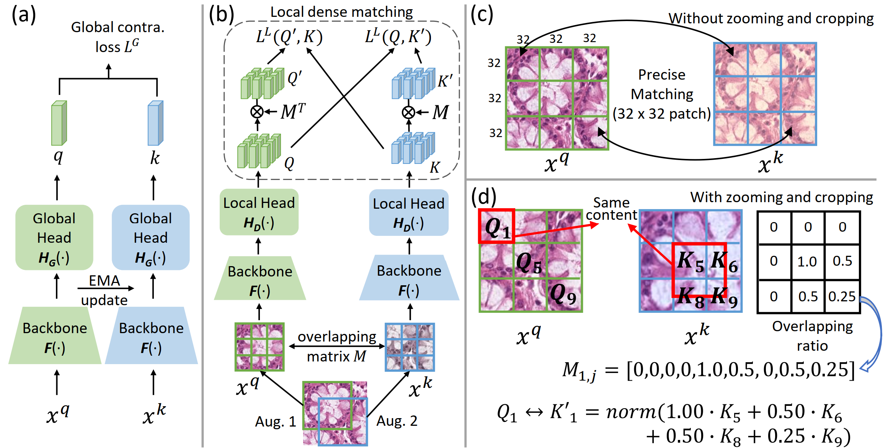

# Precise Location Matching Improves Dense Contrastive Learning in Digital Pathology

Pytorch implementation for the locally supervised learning framework described in the paper [Precise Location Matching Improves Dense Contrastive Learning in Digital Pathology](https://arxiv.org/abs/2212.12105)(_IPMI 2023_).

<div>
  
</div>

## Installation
Please refer to the [OpenSelfSup](https://github.com/open-mmlab/OpenSelfSup) for installation instructions.
You can also check our core implementation in [openselfsup/datasets/contrastive_bbox.py](openselfsup/datasets/contrastive_bbox.py), [openselfsup/models/locmat_cl.py](openselfsup/models/locmat_cl.py) and [openselfsup/models/necks_matching.py](openselfsup/models/necks_matching.py) to integrate it to your own frameworks.

## Training
Training scripts can be found under ```tools``` folder, e.g. to conduct our PLM_SSL pretraining on 4 GPUs, you can use:
```
python -W ignore -mtorch.distributed.launch --nproc_per_node=4 --master_port=60123 tools/train.py configs/PLM_SSL/r18_bs256_ep200_lambda_1.0.py --work_dir [output_directory] --seed 0 --launcher pytorch
```

For downstream segmentation, please install [detectron2](https://github.com/facebookresearch/detectron2). You can use ```segmentation/detection/train_net.py``` to train and evaluate on downstream dataset, e.g.
```
python tools/extract_backbone_weights.py  $weights_dir/epoch_200.pth  $weights_dir/segmentation/backbone.pth

cd segmetation/detection

python convert-pretrain-to-detectron2.py $weights_dir/segmentation/backbone.pth $weights_dir/segmentation/backbone.pkl

python train_net.py --config-file configs/GlaS/GlaS_R_18_FPN_1x_moco.yaml --num-gpus 4 --datasets-folder /gpfs/scratch/jingwezhang/data/segmentation MODEL.WEIGHTS $weights_dir/segmentation/backbone.pkl SOLVER.IMS_PER_BATCH 16 OUTPUT_DIR $weights_dir/segmentation/GlaS_R_18_FPN_1x_moco/1

python train_net.py --config-file configs/CRAG/CRAG_R_18_FPN_1x_moco.yaml --num-gpus 4 --datasets-folder /gpfs/scratch/jingwezhang/data/segmentation  MODEL.WEIGHTS $weights_dir/segmentation/backbone.pkl SOLVER.IMS_PER_BATCH 16 OUTPUT_DIR $weights_dir/segmentation/CRAG_R_18_FPN_1x_moco/1
```
You can also check [this repository](https://github.com/TencentAILabHealthcare/ConCL/tree/master/benchmarks/detection) for more information.

## Contact
If you have any questions or concerns, feel free to report issues or directly contact us (Jingwei Zhang <jingwezhang@cs.stonybrook.edu> or Saarthak Kapse <saarthak.kapse@stonybrook.edu>). 

## Acknowledgments
Most of our code was borrowed from [OpenSelfSup](https://github.com/open-mmlab/OpenSelfSup) and [ConCL](https://github.com/TencentAILabHealthcare/ConCL). Thanks for their outstanding work.

## Citation
If you use the code or results in your research, please use the following BibTeX entry.  
```
@article{zhang2022precise,
  title={Precise Location Matching Improves Dense Contrastive Learning in Digital Pathology},
  author={Zhang, Jingwei and Kapse, Saarthak and Ma, Ke and Prasanna, Prateek and Vakalopoulou, Maria and Saltz, Joel and Samaras, Dimitris},
  journal={arXiv preprint arXiv:2212.12105},
  year={2022}
}
```